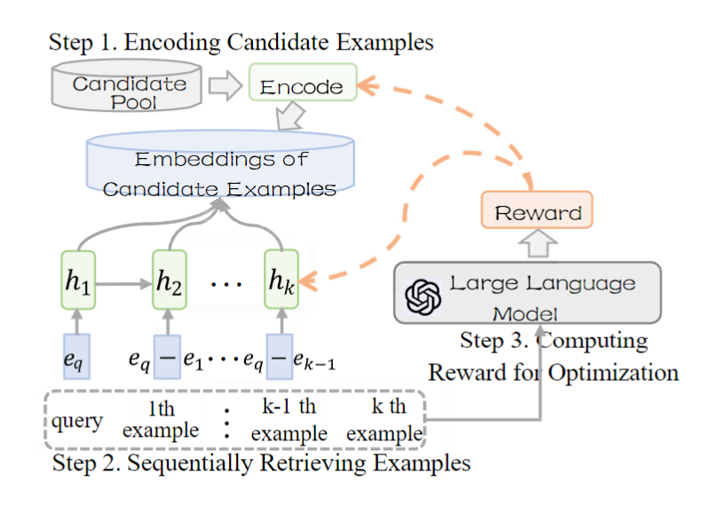

## Improving In-Context Learning via Sequentially Retrieval and Preference Alignment for Few-Shot Aspect-Based Sentiment Analysis

---

### Abstract

In this paper, we leverage in-context learning (ICL) paradigm to handle few-shot aspect-based sentiment analysis (ABSA). Previous works first rank candidate examples by some metrics and then independently retrieve examples similar to test samples. However, their effectiveness may be discounted because of two limitations:

* in-context example redundancy and example preference misalignment between retriever and LLM.

  

To alleviate them, we propose a novel framework that sequentially retrieves in-context examples.

1) It not only considers which example is useful for the test sample but also prevents its information from being duplicated by already retrieved examples.
2) Subsequently, we exploit the rewards of LLMs on retrieved in-context examples to optimize parameters for bridging preference gaps.

Experiments on four ABSA datasets show that our framework is significantly superior to previous works.

### Overview

  

Figure 2 depicts the proposed framework, which comprises three steps:

1) encoding candidate examples,
2) sequentially retrieving examples,
3) computing reward for optimization.

### Main Results

  

---

### Follow the steps below to run the code:

1. download pre-trained model weights from [huggingface](https://huggingface.co/docs/transformers/model_doc/bert), and put it in `./pretrain_models` directory
2. download data according to references
3. download  large models (some code can see [llama-13b-chat](https://huggingface.co/meta-llama/Llama-2-13b-chat)
4. install packages (see `requirements.txt`)
5. run `./run_base.sh`

---
